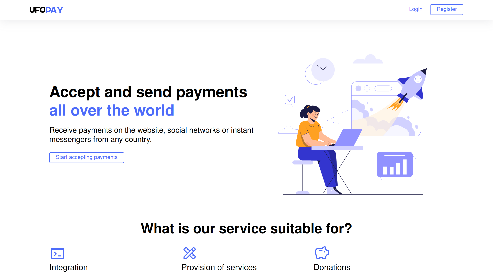

<h1 style="text-align: center; font-size: 30px;">🚀 About me</h1>

<h4 style="font-size: 20px; text-align: center;">Full-Stack Web Developer</h4>

<h2 style="text-align: center">👩‍💻 Languages</h2>

<h2 style="text-align: center">📚 Frameworks & Library</h2>

<h2 style="text-align: center">⚡ Databases</h2>

<h2 style="text-align: center">💻 Other</h2>

<h2>🧐 Portfolio</h2>

<kbd><kbd>CLICK</kbd> to expand!</kbd>

<h3><a href="https://github.com/A252dev/UFOPay">1. UFOPay</a></h3>
<blockquote>Banking system with the possibility of registration, authorization. It is possible to change your data, as well as replenish and convert currency. During conversion API is used to get the current exchange rate. At the moment the service is under development, but you can already try the demo version of the project: <a href="https://ufopay.io/">https://ufopay.io</a></blockquote> 
 
   

<h3><a href="https://github.com/A252dev/Ebalo">2. Ebalo</a></h3>
<blockquote>Failed messenger with the ability to correspond between users. Although judging by its name it was designed for that. You can evaluate the alpha version of this "masterpiece" by clicking here: <a href="http://www.ebalo.org/">http://www.ebalo.org</a></blockquote> 
    

<h3><a href="https://github.com/A252dev/MailSorter">3. MailSorter</a></h3>
<blockquote>A script that takes data from a txt file and sorts it by keyword, e.g. outlook.com</blockquote> 
 

<h3><a href="https://github.com/A252dev/DiamondStealer">4. DiamondStealer</a></h3>
<blockquote>Automated bot, server part and the stealer itself. It can scan and decrypt data from the following browsers: Firefox, Edge, Chrome and Opera.</blockquote> 
  

<h3><a href="https://github.com/A252dev/TGShop">5. TGShop</a></h3>
<blockquote>Automated bot store to sell your products. Product categories and automatic giveaway on purchase are present.</blockquote> 
  

<h3><a href="https://github.com/A252dev/BlazorUFO">6. BlazorUFO</a></h3>
<blockquote>Displayed part of my UFOPay project.</blockquote> 
    

