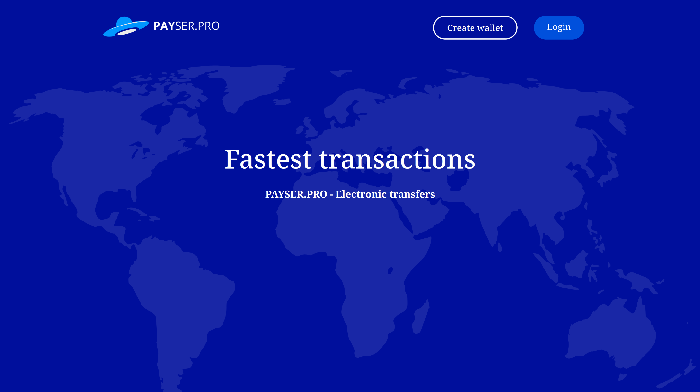

<h2>🚀 About Me</h2>

<h4>• Middle Full-Stack Developer</h4>
<h4>• 3+ Years of commercial // freelance experience</h4>

<h2>📞 You can contact me here:</h2>

<h4>• Telegram: @a252dev</h4>
<h4>• Discord: a252dev</h4>

<h2>👩‍💻 Languages</h2>

<h2>📚 Frameworks & Library</h2>

<h2>⚡ Databases</h2>

<h2>👨‍💻 Office</h2>

<h2>💻 Other</h2>

## ✨ Portfolio

<button><kbd><kbd>CLICK</kbd> to see the portfolio!</kbd></button>

### <a href="https://github.com/A252dev/UFOPay">1. UFOPay (Full-Stack)</a>

<blockquote>Payment system. It is possible to transfer and convert 24 currencies, which allows you to send money all over the world.</blockquote>

### <a href="https://github.com/A252dev/ufo-lar">2. UFO-lar (Back-End)</a>

<blockquote>Payment system API. It is possible to transfer and convert 24 currencies.</blockquote>

### <a href="https://github.com/A252dev/spring-ufo">3. Spring-UFO (Back-End)</a>

<blockquote>Payment system API. It is possible to transfer and convert 24 currencies.</blockquote>

### <a href="https://github.com/A252dev/ng-ufo">4. Ng-UFO (Front-End)</a>

<blockquote>Payment system layout. Authorization on the project is implemented using JWT token, obtaining information about the profile, as well as user actions such as balance replenishment, transfer and currency conversion is done through API requests.</blockquote>

### <a href="https://github.com/A252dev/ufo-np">5. UFO-Np (Front-End)</a>

<blockquote>SPA application that allows and get up-to-date information from the server as soon as possible.</blockquote>

### <a href="https://github.com/A252dev/Ebalo">6. Ebalo (Full-Stack)</a>

<blockquote>Messenger with the ability to communicate between users. Authorization takes place via Cookie, live chat is made using AJAX requests.</blockquote>

### <a href="https://github.com/A252dev/payser-branch">7. PaySer-branch (Front-End)</a>

<blockquote>SPA application.</blockquote>

### <a href="https://github.com/A252dev/TGShop">8. TGShop (Telegram API)</a>

<blockquote>Automated bot store to sell your products. Product categories and automatic giveaway on purchase are present.</blockquote>

### <a href="https://github.com/A252dev/BlazorUFO">9. BlazorUFO (Front-End)</a>

<blockquote>SPA application.</blockquote>

### <a href="https://github.com/A252dev/DiamondStealer">10. DiamondStealer</a>

<blockquote>Telegram bot for buying a stiller. The stiller itself, an intermediate server and an admin server that handles passwords, cookies. After that, it gives the already expanded data.</blockquote>

### <a href="https://github.com/A252dev/MailSorter">11. MailSorter</a>

<blockquote>A script that takes data from a txt file and sorts it by keyword, e.g. outlook.com.</blockquote>

