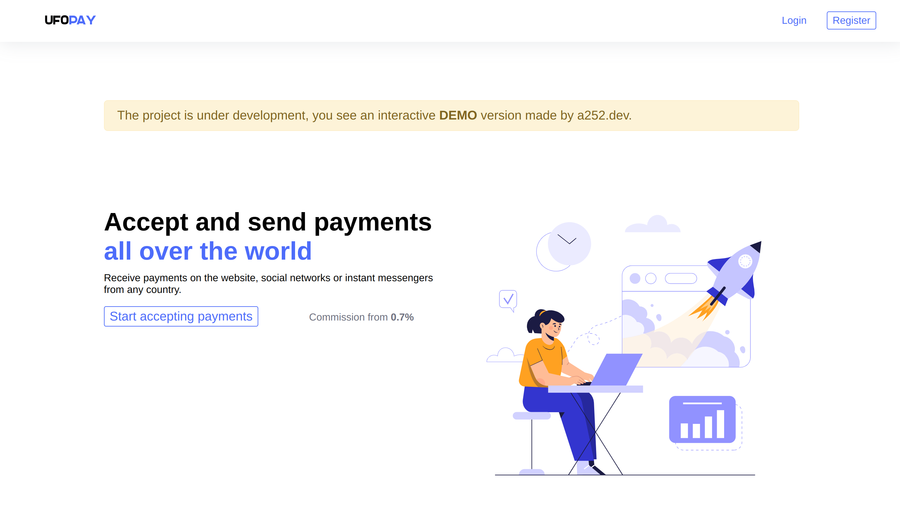
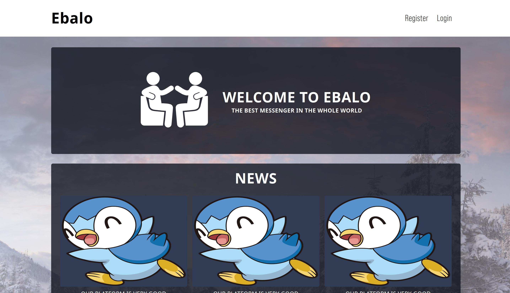

<h2 style="text-align: center">🚀 About Me</h2>

<h4 style="text-align: center">• Middle Full-Stack Developer</h4>
<h4 style="text-align: center">• 3+ Years of commercial // freelance experience</h4>

<h2 style="text-align: center">📞 You can contact me here:</h2>

<h4 style="text-align: center">• Telegram: @a252dev</h4>
<h4 style="text-align: center">• Discord: a252dev</h4>

<h2 style="text-align: center">👩‍💻 Languages</h2>

<h2 style="text-align: center">📚 Frameworks & Library</h2>

<h2 style="text-align: center">⚡ Databases</h2>

<h2 style="text-align: center">👨‍💻 Office</h2>

<h2>💻 Other</h2>

## ✨ Portfolio

<button><kbd><kbd>CLICK</kbd> to see the portfolio!</kbd></button>

### <a href="https://github.com/A252dev/UFOPay">1. UFOPay (Full-Stack)</a>

<blockquote>Payment system. It is possible to transfer and convert 24 currencies, which allows you to send money all over the world.</blockquote>

### <a href="https://github.com/A252dev/ufo-lar">2. UFO-lar (Back-End)</a>

<blockquote>Payment system API. It is possible to transfer and convert 24 currencies.</blockquote>

### <a href="https://github.com/A252dev/spring-ufo">3. Spring-UFO (Back-End)</a>

<blockquote>Payment system API. It is possible to transfer and convert 24 currencies.</blockquote>

### <a href="https://github.com/A252dev/ng-ufo">4. Ng-UFO (Front-End)</a>

<blockquote>SPA application that allows and get up-to-date information from the server as soon as possible.</blockquote>

### <a href="https://github.com/A252dev/ufo-np">5. UFO-Np (Front-End)</a>

<blockquote>SPA application.</blockquote>

### <a href="https://github.com/A252dev/Ebalo">6. Ebalo (Full-Stack)</a>

<blockquote>A messenger that allows instant messaging between users.</blockquote>

